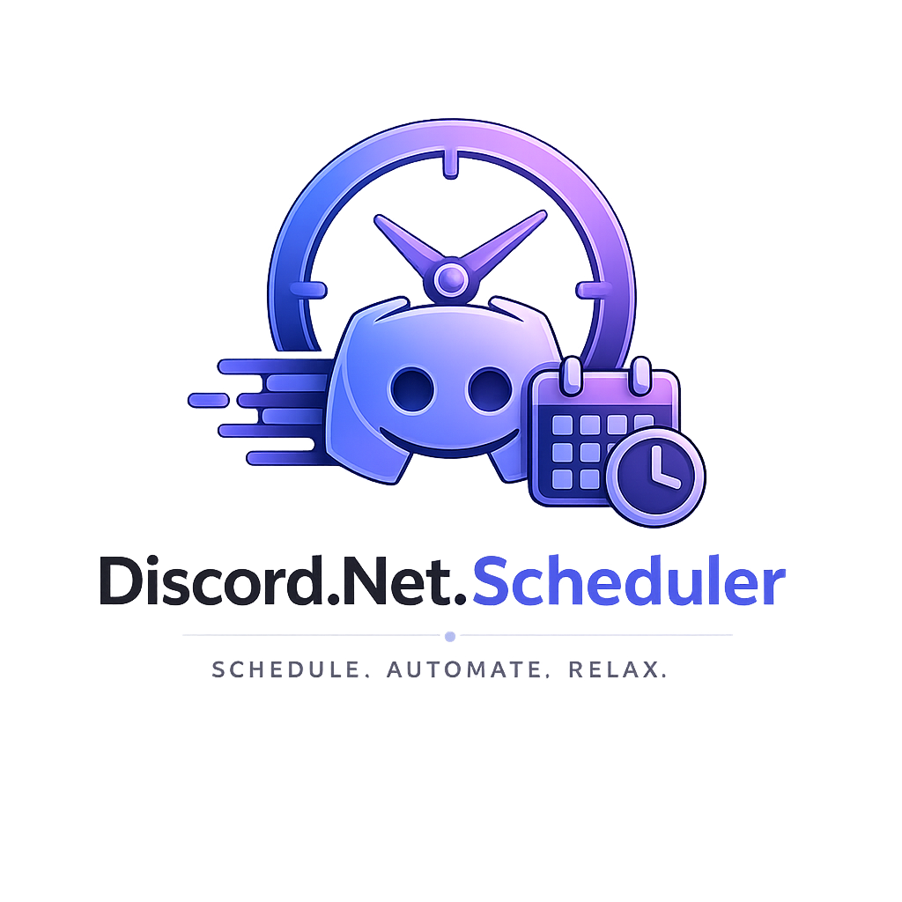

<div align="center">
  
  <h1>Discord.Net.Scheduler</h1>
  <p>Cron jobs, delayed messages, and scheduled tasks for Discord.NET bots.<br/>
  Because scheduling should be easy, not a project in itself.</p>

  <p>
    <a href="https://www.nuget.org/packages/Discord.Net.Scheduler">
      
    </a>
    <a href="https://www.nuget.org/packages/Discord.Net.Scheduler">
      
    </a>
    <a href="https://github.com/Zont1k/Discord.Net.Scheduler/actions/workflows/ci.yml">
      
    </a>
    <a href="LICENSE">
      
    </a>
  </p>
</div>

```sh
dotnet add package Discord.Net.Scheduler
```

Or for persistent storage:

```sh
dotnet add package Discord.Net.Scheduler.Redis
dotnet add package Discord.Net.Scheduler.EntityFrameworkCore
```

---

## Why this exists

Every Discord.NET bot eventually needs to send a message at a specific time — 
be it a daily announcement, a reminder 30 minutes after someone joins a voice
channel, or a weekly digest. Most people just throw in a `Timer` or add Quartz.NET
and fight with it for a day. This library is the middle ground: it understands
Discord.NET types natively, doesn't require you to learn a whole new job system,
and still gives you the serious stuff (persistent stores, middleware, telemetry).

---

## Quick start

Register the scheduler in your DI container:

```csharp
builder.Services.AddDiscordScheduler(options =>
{
    options.PollingIntervalMs = 1000;
    options.RecoverJobsOnStart = true;
});
```

Get the scheduler and start scheduling:

```csharp
var scheduler = host.Services.GetRequiredService<JobScheduler>();

// Send a message in 30 seconds
await scheduler.ScheduleAsync(job => job
    .SendMessage(channelId, "⏰ This fires in 30 seconds!")
    .In(TimeSpan.FromSeconds(30))
    .WithName("welcome-message"));

// Daily at 8 AM, timezone-aware
await scheduler.ScheduleRecurringAsync(job => job
    .SendMessage(channelId, "🌅 Good morning!")
    .WithCron("0 8 * * *")
    .WithTimezone(TimeZoneInfo.FindSystemTimeZoneById("FLE Standard Time")));
```

That's it. The scheduler runs as a `BackgroundService`, checks for due jobs
every second (configurable), handles retries, and logs everything.

---

## What you can schedule

### Send a text message

```csharp
await scheduler.ScheduleAsync(job => job
    .SendMessage(channelId, "Hello from the past!")
    .At(new DateTimeOffset(2026, 12, 25, 10, 0, 0, TimeSpan.Zero)));
```

### Send an embed (with optional text)

```csharp
var embed = new EmbedBuilder()
    .WithTitle("Scheduled Announcement")
    .WithDescription("This was planned in advance!")
    .WithColor(Color.Purple)
    .Build();

await scheduler.ScheduleAsync(job => job
    .SendEmbed(channelId, embed, "Check this out!")
    .WithDelay(TimeSpan.FromHours(2)));
```

### Edit an existing message

```csharp
await scheduler.ScheduleAsync(job => job
    .EditMessage(channelId, messageId, "Updated content!")
    .At(new DateTimeOffset(2026, 6, 15, 12, 0, 0, TimeSpan.Zero)));
```

### Run arbitrary code

When you need something custom:

```csharp
await scheduler.ScheduleAsync(job => job
    .Execute(async (ctx, ct) =>
    {
        var logger = ctx.GetService<ILogger<Program>>();
        logger.LogInformation("Running maintenance at {Time}", DateTimeOffset.UtcNow);

        var guild = ctx.Client.GetGuild(guildId);
        var channels = guild.Channels;

        return JobResult.Success(TimeSpan.Zero);
    })
    .WithCron("0 3 * * *")
    .WithName("maintenance-task"));
```

The `ctx` gives you access to the Discord client and DI container —
`ctx.GetService<T>()` and `ctx.GetOptionalService<T>()`.

---

## Recurring jobs

RecurringJobBuilder has helpers so you don't always have to type cron:

```csharp
await scheduler.ScheduleRecurringAsync(job => job
    .SendMessage(channelId, "it's midnight")
    .Daily());

await scheduler.ScheduleRecurringAsync(job => job
    .SendMessage(channelId, "top of the hour")
    .Hourly());

await scheduler.ScheduleRecurringAsync(job => job
    .SendMessage(channelId, "sunday morning")
    .Weekly());

await scheduler.ScheduleRecurringAsync(job => job
    .SendMessage(channelId, "new month!")
    .Monthly());
```

Or write your own cron:

```csharp
.WithCron("*/15 * * * *")  // every 15 minutes
.WithCron("0 9-17 * * 1-5")  // 9 AM to 5 PM, weekdays
.WithCron("@hourly")  // named shortcuts work too
```

---

## Event triggers

Jobs can react to Discord events, not just time. Mix and match with cron or delay.

### When a user joins

```csharp
await scheduler.ScheduleAsync(job => job
    .SendMessage(channelId, $"Welcome <@123456789>!")
    .WhenUserJoins(123456789));
```

### When a message is sent

```csharp
await scheduler.ScheduleAsync(job => job
    .Execute(async (ctx, ct) =>
    {
        // reply logic
        return JobResult.Success();
    })
    .WhenMessageSent(channelId: 987654321, pattern: "!help"));
```

Without a pattern, every message in that channel triggers the job.

### After another job completes

```csharp
await scheduler.ScheduleAsync(job => job
    .WithName("cleanup")
    .Execute(async (ctx, ct) => { /* cleanup */ return JobResult.Success(); })
    .AfterJob("backup-job"));

// "backup-job" runs first, then "cleanup" runs automatically
// The dependent job won't execute until its prerequisite completes
```

---

## Job dependencies

Chain jobs together. A dependent job waits until all its prerequisites succeed.

```csharp
await scheduler.ScheduleAsync(job => job
    .WithId("backup-db")
    .Execute(/* backup database */));

await scheduler.ScheduleAsync(job => job
    .WithId("backup-files")
    .Execute(/* backup files */));

// Runs only after both backups complete
await scheduler.ScheduleAsync(job => job
    .WithId("upload-s3")
    .Execute(/* upload to S3 */)
    .After("backup-db", "backup-files"));
```

### Conditional execution with RunIf

```csharp
await scheduler.ScheduleAsync(job => job
    .SendMessage(channelId, "Market is open!")
    .WithCron("0 9-17 * * 1-5")
    .RunIf(sp =>
    {
        var calendar = sp.GetRequiredService<IMarketCalendar>();
        return Task.FromResult(calendar.IsTodayTradingDay());
    }));
```

The job only runs when the delegate returns `true`. The delegate receives the DI
container so you can resolve services without static singletons.

---

## Performance

Numbers from `benchmarks/Discord.Net.Scheduler.Benchmarks` on .NET 10, in-memory store:

| Jobs | GetAllAsync | GetPendingAsync | Lookup by ID | Serialize | Deserialize | Allocated / 1000 jobs |
|------|-------------|-----------------|--------------|-----------|-------------|-----------------------|
| 100 | ~2 µs | ~2 µs | ~0.05 µs | ~2 µs | ~1 µs | ~150 KB |
| 1 000 | ~12 µs | ~12 µs | ~0.05 µs | ~2 µs | ~1 µs | ~1.5 MB |
| 10 000 | ~110 µs | ~110 µs | ~0.05 µs | ~2 µs | ~1 µs | ~15 MB |
| 50 000 | ~540 µs | ~540 µs | ~0.05 µs | ~2 µs | ~1 µs | ~75 MB |

- **Lookup is O(1)** — the `InMemoryJobStore` and `RedisJobStore` both use dictionary-based indexing.
- **GetAllAsync / GetPendingAsync is O(n)** — scales linearly with job count.
- **Serialization** is per-job, not affected by total count.
- **Memory** depends on job complexity (embeds are heavier than plain messages).
- The scheduler polls every `PollingIntervalMs` (default 1 s) — even at 50 000 jobs,
  each poll completes in under a millisecond. The bottleneck is always your job's
  own work (Discord API calls, database writes), not the scheduler.

Run the benchmarks yourself:

```sh
dotnet run --project benchmarks/Discord.Net.Scheduler.Benchmarks -c Release
```

---

## Job API

```csharp
// Schedule a one-time job
ScheduleAsync(Action<ScheduledJobBuilder> build)

// Schedule a recurring job
ScheduleRecurringAsync(Action<RecurringJobBuilder> build)

// Cancel a job
CancelAsync(string jobId)

// Move a job to a different time
RescheduleAsync(string jobId, DateTimeOffset newTime)

// Query jobs
GetJobAsync(string jobId)
GetPendingJobsAsync()
GetAllJobsAsync()
GetJobCountAsync()
```

Every builder method returns the builder, so you chain as much or as little
as you want:

```csharp
.WithCron("0 8 * * *")
.WithTimezone(tz)
.WithRetries(5, TimeSpan.FromSeconds(30))
.ExpiresAt(DateTimeOffset.UtcNow.AddDays(7))
.WithMetadata("author", "ozotov");
```

---

## Cron expressions

Standard 5-field cron. No 6th field for seconds, no year field — keeps it
predictable.

| Shortcut | Expands to |
|----------|------------|
| @yearly / @annually | 0 0 1 1 * |
| @monthly | 0 0 1 * * |
| @weekly | 0 0 * * 0 |
| @daily / @midnight | 0 0 * * * |
| @hourly | 0 * * * * |

| Field | Range | Specials |
|-------|-------|----------|
| Minute | 0-59 | * , - / |
| Hour | 0-23 | * , - / |
| Day of Month | 1-31 | * , - / |
| Month | 1-12 | * , - / |
| Day of Week | 0-7 (0 and 7 = Sunday) | * , - / |

Step values work: `*/15` for every 15 minutes, `0-30/5` for every 5 minutes
in the first half-hour. Named months/days are not supported — just use numbers.

---

## Persistent storage

By default jobs live in memory and die when your bot restarts. For production
you'll want something that survives a crash.

### Redis

```csharp
services.AddDiscordScheduler();
services.AddRedisJobStore("localhost:6379");
```

You can pass a `ConnectionMultiplexer` if you already have one:

```csharp
services.AddRedisJobStore(multiplexer, keyPrefix: "mybot:jobs:");
```

### EF Core

Works with any provider — SQLite, PostgreSQL, SQL Server:

```csharp
services.AddDiscordScheduler();
services.AddEfCoreJobStore<SchedulerDbContext>(options =>
    options.UseSqlite("Data Source=jobs.db"));
```

Your context inherits from `SchedulerDbContext`:

```csharp
public class MyDbContext : SchedulerDbContext
{
    public MyDbContext(DbContextOptions options) : base(options) { }
}
```

### Write your own

Implement `IJobStore`:

```csharp
public class MyJobStore : IJobStore
{
    public Task AddAsync(IScheduledJob job, CancellationToken ct) { /* ... */ }
    // ... IJobStore has AddAsync, RemoveAsync, GetAsync, GetPendingAsync,
    //     GetAllAsync, UpdateAsync, MarkCompletedAsync, MarkFailedAsync,
    //     CountAsync, ClearAsync
}

services.AddJobStore<MyJobStore>();
```

---

## Middleware

Jobs pass through a pipeline before execution. Middleware can log, measure,
rate-limit, or short-circuit execution:

```csharp
services.AddDiscordScheduler();
services.AddJobMiddleware<LoggingMiddleware>();
services.AddJobMiddleware<ErrorHandlingMiddleware>();
```

Or add middleware inline:

```csharp
var pipeline = host.Services.GetRequiredService<JobExecutionPipeline>();
pipeline.Use(async (ctx, next) =>
{
    ctx.Metadata["started"] = DateTimeOffset.UtcNow.ToString("O");
    var result = await next(ctx);
    ctx.Metadata["finished"] = DateTimeOffset.UtcNow.ToString("O");
    return result;
});
```

Built-in middleware:
- **LoggingMiddleware** — logs execution start, duration, result
- **ErrorHandlingMiddleware** — catches exceptions, marks job failed
- You can write your own by implementing `IJobMiddleware`

---

## Source generators (AOT)

If you're targeting native AOT or just hate reflection, annotate your classes
with `[CronJob]`:

```csharp
[CronJob("0 9 * * *")]
public partial class DailyDigestJob : IDiscordCronJob
{
    private readonly DiscordSocketClient _client;
    private readonly ILogger<DailyDigestJob> _logger;

    public DailyDigestJob(DiscordSocketClient client, ILogger<DailyDigestJob> logger)
    {
        _client = client;
        _logger = logger;
    }

    public async Task<JobResult> ExecuteAsync(JobContext context, CancellationToken ct)
    {
        var channel = await _client.GetChannelAsync(channelId) as IMessageChannel;
        return JobResult.Success(TimeSpan.Zero);
    }
}
```

The source generator picks it up at compile time and generates
`AddGeneratedCronJobs()` — no runtime scanning, no reflection.

---

## OpenTelemetry

Every job execution emits metrics. Enabled by default via
`SchedulerOptions.EnableMetrics = true`.

| Metric | What it tracks |
|--------|----------------|
| scheduler.job.scheduled | Counter — new jobs created |
| scheduler.job.completed | Counter — successful runs |
| scheduler.job.failed | Counter — jobs that errored out |
| scheduler.job.cancelled | Counter — cancelled before execution |
| scheduler.job.execution_time | Histogram — how long jobs took (ms) |
| scheduler.job.active | Gauge — currently executing |

```csharp
services.AddOpenTelemetry()
    .WithMetrics(metrics => metrics
        .AddMeter("Discord.Net.Scheduler")
        .AddConsoleExporter());
```

---

## Comparison with alternatives

| | This | Quartz.NET | Hangfire | Manual Timer |
|--|------|------------|----------|--------------|
| Discord-first API | yes | no | no | yes |
| Cron + timezones | yes | yes | yes | no |
| Persistent store | Redis, EF Core | many | SQL | no |
| Middleware pipeline | built-in | not really | no | no |
| AOT / source gen | yes | no | no | no |
| OpenTelemetry | yes | no | not built-in | no |
| Package size | ~200 KB | ~5 MB | ~3 MB | 0 |
| Setup time | 2 lines | ~50 lines | ~10 lines | you build it |

Quartz.NET is more battle-tested, but it's massive and has no idea what a
Discord channel is. Hangfire is great for web apps but doesn't speak Discord
either. If you just need to schedule Discord messages and you want it done
today, this library is probably a better fit.

---

## Building from source

```sh
dotnet build
dotnet test    # 43 tests, last I checked
dotnet pack    # produces nuget packages in ./artifacts/
```

The solution targets `net8.0`, `net9.0`, and `net10.0` for the main library,
and `netstandard2.0` for the source generator (so it works with any SDK).

---

## Project structure

```
src/
├── Discord.Net.Scheduler/              # core library
│   ├── Jobs/                           # job types + JobWrapper for serialization
│   ├── Scheduling/                     # CronParser, CronExpression, JobScheduler
│   │   └── JobStore/                   # IJobStore + InMemoryJobStore
│   ├── Pipeline/                       # JobExecutionPipeline, middleware
│   ├── Extensions/                     # DI registration
│   └── Telemetry/                      # SchedulerMetrics
├── Discord.Net.Scheduler.Redis/        # RedisJobStore
├── Discord.Net.Scheduler.EntityFrameworkCore/  # EfJobStore + SchedulerDbContext
└── Discord.Net.Scheduler.SourceGenerator/      # [CronJob] source generator
```

---

## What's missing / known quirks

- No GUI dashboard yet (planned, but I wanted the core solid first)
- Redis serializer uses `JobWrapper` — it works but if you have complex
  custom job types you'll need to handle deserialization yourself
- The NuGet package has a NU1902 warning for OpenTelemetry.Api 1.11.2
  (moderate severity — non-critical for Discord bots, but I'll bump it)
- XML doc comments are there for public API but some edge cases aren't
  documented yet — PRs welcome

---

## License

MIT. Do what you want, just don't blame me when your bot sends a scheduled
message at 3 AM to the wrong channel because you set the timezone wrong.
